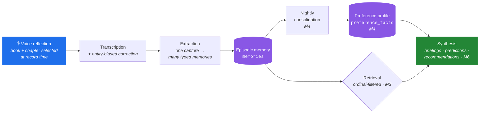
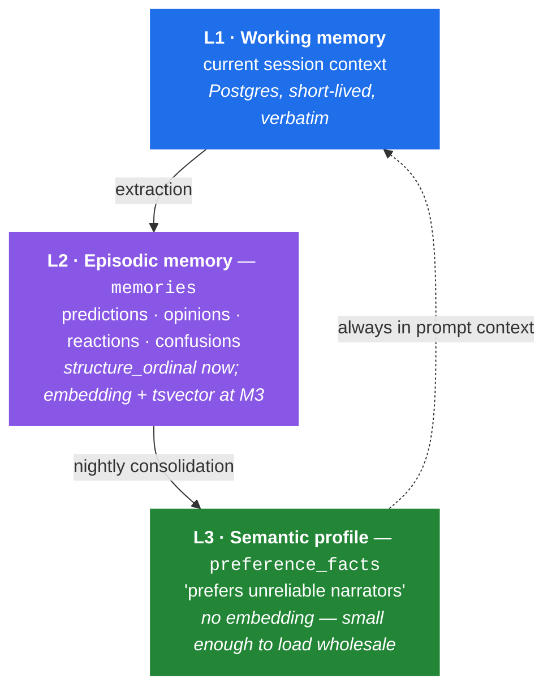
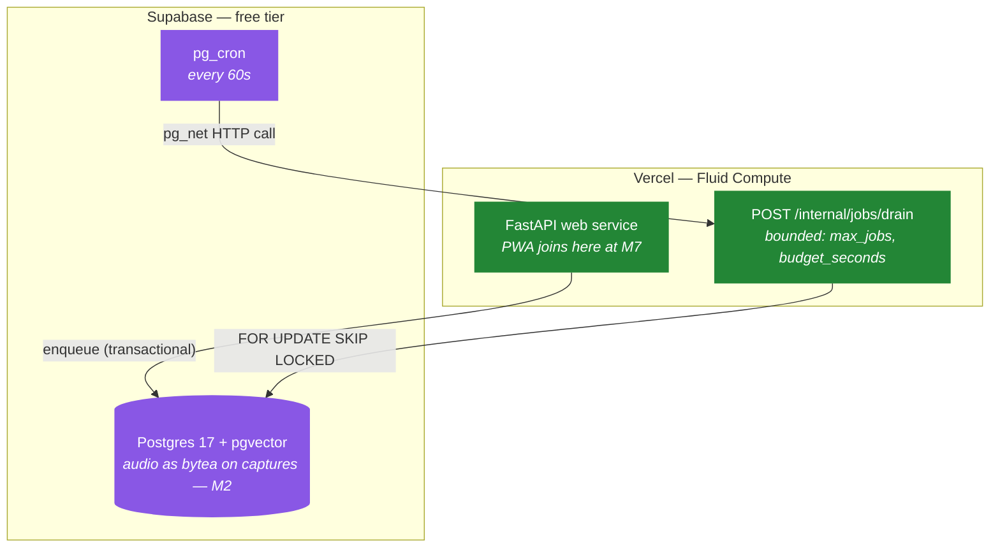

# ALAM — Adaptive Learning Associative Memory

[](https://github.com/aabu4537/ALAM/actions/workflows/ci.yml)

A personal AI media companion. You record a short voice reflection while reading;
it is transcribed, decomposed into typed memories, and consolidated into an
evolving preference profile. The system uses both to produce spoiler-safe
insights, prediction resolutions, and recommendations.

V1 covers **books only**. This is a single-user personal system that doubles as a
portfolio artifact — not a SaaS product, and not built for multi-tenancy or
horizontal scale.

> **Status: M0, M1, and M2 complete, M3 not started.** Deployed and live at
> [alam-zeta.vercel.app](https://alam-zeta.vercel.app) — there is no frontend
> yet (that's M7), but the API is real:
>
> ```bash
> curl https://alam-zeta.vercel.app/health
> curl https://alam-zeta.vercel.app/demo/books
> ```
>
> The second one returns a seeded, invented reading history — the demo persona
> generator from M1, extended at M2 to carry one book's reflection all the way
> through to extracted memories. It is not the owner's real data; that
> boundary is structural, not a convention (see "Standing constraints" below).
> The milestone table further down marks what is real. Nothing in this README
> describes behaviour that is not committed.

---

## The core loop



**A through D are real** as of M2 — a raw-audio API, not a recording UI (that's
M7); everything from E onward is still ahead. The pipeline is **deterministic**
— input → processing → retrieval → synthesis → memory update. There is no
autonomous agent in V1. Agents are reconsidered at M6, when multiple knowledge
sources make retrieval orchestration a real problem rather than a decoration
([ADR-0001](docs/adr/0001-memory-architecture.md)).

---

## The idea the design rests on

Every structural unit of a book — a chapter — gets an integer **`ordinal`**. That
one column is load-bearing across three otherwise unrelated concerns:

| Concern | How the ordinal carries it |
|---|---|
| **Spoiler containment** | Retrieval filters `WHERE structure_ordinal <= :current`. Deterministic, index-backed, no model in the loop. |
| **Chunking** | Content chunks may never cross a unit boundary — a chunk spanning chapters 7 and 8 is unfilterable, so the spoiler boundary *dictates* the chunking strategy. |
| **Media extensibility** | A chapter, a TV episode, a film scene, and a podcast segment are all just ordinals. Memory, retrieval, profile, and predictions are already media-agnostic. |

`structure_ordinal` is **denormalized onto `memories` on purpose**, so the spoiler
filter stays an index-only predicate. That is a settled decision, not an
oversight ([ADR-0002](docs/adr/0002-spoiler-containment.md),
[ADR-0003](docs/adr/0003-media-abstraction.md)).

### On spoilers, honestly

The original requirement read "the AI must never spoil future content." That is
not achievable and is not claimed here. The model has the book in its weights;
no retrieval filter removes that. The requirement is restated as **a measured
leakage rate under defense in depth** — data filter, prompt constraint, output
classifier checked against the *excluded* set, and an adversarial eval suite
that produces a number. The number goes in this README when it exists.

---

## Memory architecture

Three tiers, because one undifferentiated table degrades badly — retrieval
precision falls off a cliff at a few thousand rows, which is exactly when the
product is supposed to start being good.



**L3 is never retrieved by vector search.** It is small by construction and
loaded into every prompt, so retrieval only has to supply specifics rather than
reconstruct who the user is on every query.

Contradictions are handled by writing a *new* fact with `supersedes_id` pointing
at the old one. Nothing is deleted. That makes taste drift queryable for free —
*"through 2024 you bounced off slow openings; since March you've rated three of
them five stars"* — a product feature falling out of a schema choice.

---

## Code layout

Dependency direction is strictly inward: `api` → `services` → `domain`.
`domain` imports nothing from the layers above it.

```
alam/
  api/            FastAPI routers. Thin. No business logic.
  domain/         Pure functions. No I/O. mypy --strict.
  services/       Orchestration across domain + persistence + ai.
  ai/
    providers/    LLM / embedding / STT Protocols + fakes.
    prompts/      Versioned prompt templates.
    extraction/   Transcript -> typed memories.
    retrieval/    (M3)
  media/
    base.py       MediaProvider Protocol.
    books/        The one implementation.
  persistence/    SQLAlchemy models, repositories, Alembic migrations.
  jobs/           Queue, worker loop, handlers.
  eval/           Evaluation harness. (M3)
  config/         Typed settings.
```

`domain/` being pure is what makes the majority of the spoiler guarantee
testable in milliseconds with no fixtures and no model in the loop.

### Standing constraints

- **No Celery, no Redis, no external broker.** The job queue is Postgres using
  `SELECT ... FOR UPDATE SKIP LOCKED`. Transactional enqueue is the point.
- **Provider access goes through Protocols**, with fakes. Tests never hit the
  network — enforced by disabling sockets, not by convention.
- **Every LLM output records the prompt version id** that produced it.
- **Every embedding column carries `embedding_model` and `embedding_version`**,
  so model migrations are incremental rather than stop-the-world.
- **Demo data and real data are separated by `user_id`.** Real reading notes are
  private and must never be reachable from demo mode.

---

## Deployment topology

All-Vercel, not split. [ADR-0005](docs/adr/0005-deployment-topology.md)
originally rejected this for one reason: the job queue is a long-lived polling
process, and serverless has nowhere to host one. What changed the answer
([ADR-0007](docs/adr/0007-serverless-worker-execution.md)) is realizing the
**trigger** and the **queue** don't have to live in the same place — `pg_cron`,
already sitting next to the queue in Postgres, can wake up a bounded HTTP drain
on a schedule Vercel Cron's Hobby tier (once a day) could never manage. No
standing worker, no paid tier, $0/month.



The health endpoint shipped to the real URL **at M0, before any feature
existed**. Deployment problems found at M0 cost an afternoon; found at M7 they
end the project.

Audio lives as `bytea` directly on the `captures` row, not in a blob store —
short voice reflections fit comfortably, and no caller yet needs one
(`persistence/models/capture.py`).

---

## What works today

Everything below is a real endpoint on the live URL, not a plan.

| Endpoint | What it does |
|---|---|
| `GET /health` | Liveness — env, version. Doesn't touch the database (ADR-0005). |
| `POST /imports/goodreads/preview` / `/commit` | CSV in, diff out, then apply. Dedupe key: ISBN13 → ISBN10 → normalized title+author. |
| `POST /books/epub/preview` / `/commit` | EPUB in, a proposed chapter structure out (from spine order), then persisted unverified. |
| `GET` / `PUT /books/{id}/structure` | Read the proposal; submit corrections. One list-replace expresses merge, split, relabel, and exclude (ADR-0004). |
| `POST /books/{id}/captures` | Raw audio in. Resumes or starts the book's active reading session at the given chapter, persists the audio, enqueues transcription. |
| `GET /books/{id}/captures/{capture_id}` | A capture's pipeline status and, once each stage runs, its raw/corrected transcript. |
| `GET /books/{id}/reading-sessions/active` | The book's current session — chapter, ordinal, normalized progress (ADR-0004). |
| `POST /books/{id}/reading-sessions/{id}/end` | Marks a session `completed` or `abandoned` — a DNF is a preference signal, never deleted. |
| `GET /demo/books` | Public, no auth. The seeded demo persona's library — see the status note above. |
| `POST /internal/jobs/drain`, `/internal/demo/seed` | Ops-only, bearer-secret protected. |

Submitting a capture enqueues three chained jobs — transcribe, correct, extract
— each independently retryable on the M0 queue rather than one long request.

No frontend calls these yet; they're driven by `curl`/tests today and will get
a PWA in M7.

---

## Milestones

| | Milestone | Status |
|---|---|---|
| **M0** | Foundation — schema, job queue, provider fakes, deployed | ✅ done |
| **M1** | Import and structure — Goodreads CSV, EPUB, chapter verification | ✅ done |
| **M2** | Capture and voice — transcription, entity correction, extraction (PWA recording UI deferred to M7) | ✅ done |
| **M3** | Memory and retrieval — hybrid search, spoiler filter, **eval harness** | ⬜ |
| **M4** | Profile — consolidation, confidence decay, supersede logic | ⬜ |
| **M5** | Predictions — lifecycle, resolution windows, evidence linking | ⬜ |
| **M6** | Synthesis — briefings, journey summaries, recommendations | ⬜ |
| **M7** | Polish — frontend, token/cost accounting, README with real numbers | ⬜ |

M3 is the milestone that makes this a portfolio project rather than a personal
tool. Stopping after M3 with a working eval harness beats stopping after M6
without one.

Full definitions of done: [`docs/milestones.md`](docs/milestones.md).

---

## Decision records

Design decisions live in [`docs/adr/`](docs/adr/) with their rationale, their
consequences, and the alternatives that were rejected.

| ADR | Decision |
|---|---|
| [0001](docs/adr/0001-memory-architecture.md) | Three-tier memory architecture |
| [0002](docs/adr/0002-spoiler-containment.md) | Spoiler containment as a measured leakage rate |
| [0003](docs/adr/0003-media-abstraction.md) | Media abstraction — seams, not a plugin system |
| [0004](docs/adr/0004-reading-progress-model.md) | Reading progress model |
| [0005](docs/adr/0005-deployment-topology.md) | Deployment topology |
| [0006](docs/adr/0006-ordinal-stability.md) | Ordinal stability and structure re-verification |
| [0007](docs/adr/0007-serverless-worker-execution.md) | Serverless worker execution — `pg_cron`-drained queue, $0/month |

---

## Development

Requires [uv](https://docs.astral.sh/uv/). Python 3.12 is installed by uv itself.

```bash
uv sync --all-groups          # install deps
cp .env.example .env          # local config
uv run uvicorn alam.api.main:app --reload
curl localhost:8000/health
```

With Docker:

```bash
docker compose up             # web + Postgres 17 with pgvector
docker compose --profile worker up   # local-only; production uses pg_cron (ADR-0007)
```

Checks — all of these run in CI on every push and pull request:

```bash
uv run ruff check . && uv run ruff format --check .
uv run mypy alam tests
uv run pytest
```

**Database tests.** Anything touching Postgres is marked `db` and **skips**
unless `ALAM_TEST_DATABASE_URL` points at a database with pgvector available.
CI always sets it, plus `ALAM_REQUIRE_DB_TESTS=1`, which turns that skip into a
failure — a broken service container would otherwise produce a green run in
which none of the schema assertions executed.

```bash
createdb alam_test
export ALAM_TEST_DATABASE_URL=postgresql+psycopg://$(whoami)@localhost:5432/alam_test
uv run pytest                    # 295 tests; without the variable, 134 skip
```

Migrations run against `ALAM_DATABASE_URL`:

```bash
uv run alembic upgrade head
uv run alembic downgrade base    # migrations round-trip cleanly
```

The worker loop, for local development — production uses the scheduled HTTP
drain instead, calling the same `drain()`:

```bash
python -m alam.jobs.loop
```

### Contributing workflow

`main` stays deployable. Work happens on a milestone branch (`m0-foundation`,
`m1-foundation`, ...), one pull request per session, squash-merged; the
milestone branch merges to `main` when its definition of done is met.
Conventional commits.

Agents working in this repo: read [`CLAUDE.md`](CLAUDE.md) first. It records the
non-negotiable decisions and, more importantly, the list of things **not** to
build yet.

---

## Limitations

Stated up front rather than discovered:

- **Spoiler containment is probabilistic, not guaranteed.** See above.
- **The profile is only as good as extraction**, since every memory flows
  through one funnel. This is why the eval harness is M3 and not M7.
- **Ordinal data is load-bearing and human-verified.** EPUB spine order is a
  hypothesis, not the answer; nothing is indexed against unverified structure
  ([ADR-0004](docs/adr/0004-reading-progress-model.md)).
- **Single-user by design.** No multi-tenancy, no horizontal scale, no caching
  layer, no read replicas.
- **Every provider is still a fake.** Transcription, correction, and
  extraction all run — deterministically, for free, offline — against the
  fakes from M0. No real STT or LLM is wired up yet; `ProviderKind` in
  `config/settings.py` permits only `"fake"`, so a real one configured before
  it exists fails at startup rather than silently.
- **Re-verifying a chapter that already has a reflection recorded against it
  fails loudly, not gracefully.** `reading_sessions`, `captures`, and
  `memories` all denormalize `structure_ordinal`; relabeling or reordering
  chapters resyncs them, but excluding or merging away a chapter that already
  has one of those rows raises an `IntegrityError` instead of repointing it.
  Safe — no silent data loss — but not yet a good experience.
