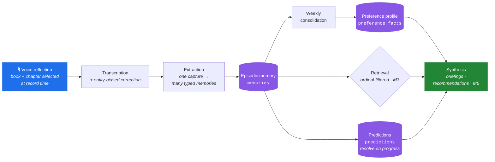
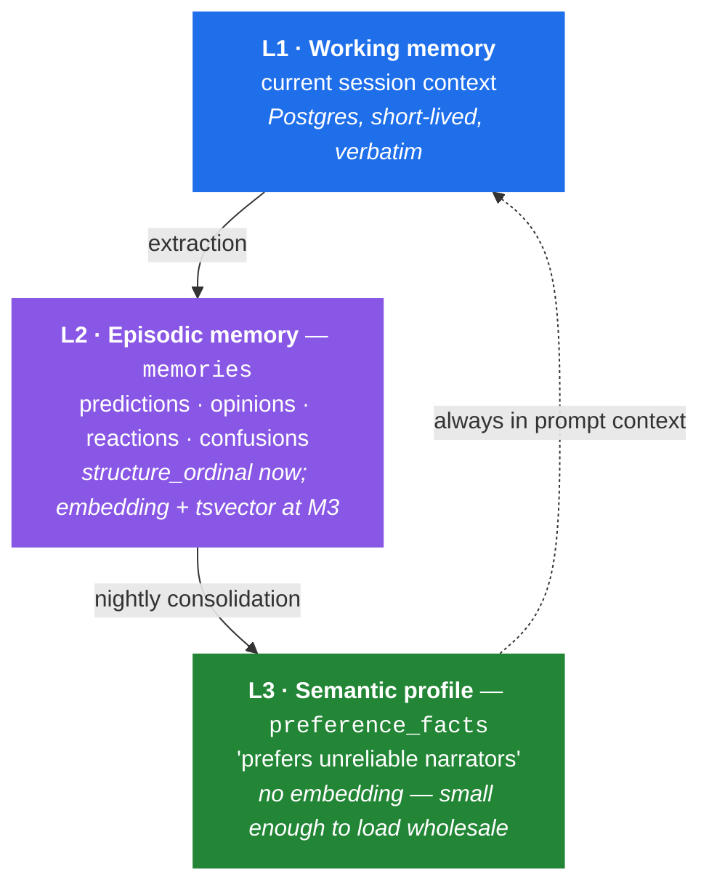
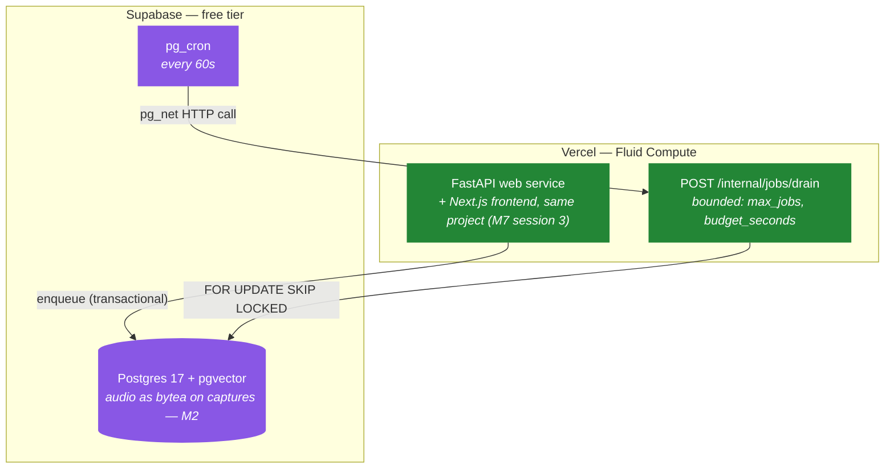

# ALAM — Adaptive Learning Associative Memory

[](https://github.com/aabu4537/ALAM/actions/workflows/ci.yml)

A personal AI media companion. You record a short voice reflection while reading;
it is transcribed, decomposed into typed memories, and consolidated into an
evolving preference profile. The system uses both to produce spoiler-safe
insights, prediction resolutions, and recommendations.

V1 covers **books only**. This is a single-user personal system that doubles as a
portfolio artifact — not a SaaS product, and not built for multi-tenancy or
horizontal scale.

> **Status: M0 through M7 complete.** Deployed and live at
> [alam-zeta.vercel.app](https://alam-zeta.vercel.app) — a password-gated
> Next.js frontend (M7 session 3, ADR-0018) sits in front of the
> owner-scoped API (M7 session 2, ADR-0017). The API itself has been real
> all along:
>
> ```bash
> curl https://alam-zeta.vercel.app/health
> curl https://alam-zeta.vercel.app/demo/books
> ```
>
> The second one returns a seeded, invented reading history — the demo persona
> generator from M1, extended at M2 to carry one book's reflection all the way
> through to extracted memories. It is not the owner's real data; that
> boundary is structural, not a convention (see "Standing constraints" below).
> The milestone table further down marks what is real. Nothing in this README
> describes behaviour that is not committed.

---

## The core loop



**A through I are all real.** A shipped as a raw-audio API at M2, with a
recording UI added on top at M7; H (synthesis) shipped at M6. The pipeline
is **deterministic**
— input → processing → retrieval → synthesis → memory update. There is no
autonomous agent in V1. Agents are reconsidered at M6, when multiple knowledge
sources make retrieval orchestration a real problem rather than a decoration
([ADR-0001](docs/adr/0001-memory-architecture.md)).

---

## The idea the design rests on

Every structural unit of a book — a chapter — gets an integer **`ordinal`**. That
one column is load-bearing across three otherwise unrelated concerns:

| Concern | How the ordinal carries it |
|---|---|
| **Spoiler containment** | Retrieval filters `WHERE structure_ordinal <= :current`. Deterministic, index-backed, no model in the loop. |
| **Chunking** | Content chunks may never cross a unit boundary — a chunk spanning chapters 7 and 8 is unfilterable, so the spoiler boundary *dictates* the chunking strategy. |
| **Media extensibility** | A chapter, a TV episode, a film scene, and a podcast segment are all just ordinals. Memory, retrieval, profile, and predictions are already media-agnostic. |

`structure_ordinal` is **denormalized onto `memories` on purpose**, so the spoiler
filter stays an index-only predicate. That is a settled decision, not an
oversight ([ADR-0002](docs/adr/0002-spoiler-containment.md),
[ADR-0003](docs/adr/0003-media-abstraction.md)).

### On spoilers, honestly

The original requirement read "the AI must never spoil future content." That is
not achievable and is not claimed here. The model has the book in its weights;
no retrieval filter removes that. The requirement is restated as **a measured
leakage rate under defense in depth** — data filter, prompt constraint, output
classifier checked against the *excluded* set, and an adversarial eval suite
that produces a number.

**Measured leakage rate: 0.0**, over a starter adversarial set of 10
hand-authored cases engineered to tempt a leak — near-duplicate phrasing, and
in a few cases identical wording, straddling the ordinal boundary
([`alam/eval/spoiler_eval.py`](alam/eval/spoiler_eval.py), enforced in CI).
The same harness, re-run against a real local embedding model rather than
the fake, reproduced the identical 0.0
([`docs/eval/baseline-local-providers.md`](docs/eval/baseline-local-providers.md))
— expected, since Layer 1 is an ordinal predicate, not a property of
embedding quality, but confirmed rather than assumed.
That number is expected and structural, not a lucky sample: Layer 1 is a SQL
predicate (`WHERE structure_ordinal <= :current`), not a model's probabilistic
judgment, so leakage at this layer is either always zero or a bug. Layers 2
and 3 (prompt constraint, output classifier) didn't exist as of M5 — they
needed a synthesis step that didn't ship until M6. `GET
/books/{id}/journey-summary` (M6 session 1) is that first step: the prompt
states the reader's position (Layer 2), and every generated draft is
checked against the exact memories the ordinal filter excluded before it's
ever persisted or returned (Layer 3,
[`alam/ai/synthesis/leak_check.py`](alam/ai/synthesis/leak_check.py)),
with its own adversarial case,
**`synthesis_leakage_rate`** ([`alam/eval/journey_summary_eval.py`](alam/eval/journey_summary_eval.py),
also enforced in CI, against the fake LLM this deployment runs — a canned
clean verdict, exercising the plumbing rather than measuring anything). The
same harness, re-run against a real local model
(`llama3.2:3b` via Ollama), **measured 0.0 for real for the first time**:
the model's own leak-check verdict on its own narrative came back clean,
and the defense-in-depth substring check (the excluded reveal's distinctive
phrasing checked against the draft actually persisted, regardless of what
Layer 3 says) also found nothing
([`docs/eval/baseline-local-providers.md`](docs/eval/baseline-local-providers.md)).
One clean case is not an adversarial clearance — see that doc for the
honest caveat — but it is the first real, model-backed signal Layer 3 has
had (see [ADR-0013](docs/adr/0013-synthesis-artifacts-and-layer3.md)).

`GET /recommendations` (M6 session 2) doesn't reuse Layer 3 — recommendations
are library-wide with no reader ordinal, so there is no excluded-content set
for a classifier to check a draft against. Instead the response schema is
built so an LLM-authored characterization of a to-read candidate's content
has no field to occupy at all: the model only selects which of the reader's
own `preference_facts`/`memories` — or, for a candidate `CatalogProvider`
(M6 session 3) has already fetched, its own catalog entry — support a
recommendation, and every claim's displayed text is composed by ALAM from
that cited record's own stored text, never written by the model. A
candidate's fetched blurb/subjects is real, Open Library-sourced text; a
candidate not yet backfilled is still exactly taste-only, degrading
gracefully rather than erroring. **Measured `recommendation_groundedness`:
0.0 ungrounded**, over a clean-citation case and a deliberately-bad-citation
positive control ([`alam/eval/recommendation_eval.py`](alam/eval/recommendation_eval.py),
enforced in CI) — fully deterministic (existence + ownership check against
the DB, extended in session 3 to also check that a cited catalog entry
actually has content), unlike Layer 3, so this number is real regardless of
which LLM provider is configured. Full design in
[ADR-0014](docs/adr/0014-recommendations-groundedness-taste-only.md) and
[ADR-0015](docs/adr/0015-catalog-provider.md).

`CatalogProvider` (`alam/catalog/`) is a narrow, one-method Protocol —
`fetch_metadata(title, author)` — deliberately not the deferred
`MediaProvider` (`media/base.py`). The real implementation calls Open
Library's free, keyless API; a resumable job-queue backfill
(`POST /internal/catalog/backfill`, same shape as the embeddings backfill)
fetches and caches metadata into `media_items.attributes["catalog"]`, once
per book, a real "not found" result recorded distinctly from "never
checked." **Not verified against a live Open Library call** — written
against the published API shape, same caveat
[`voyage_embeddings.py`](alam/ai/providers/real/voyage_embeddings.py)
carries for its own real client.

`GET /books/{id}/briefing` (M6 session 4, the last M6 deliverable) is a
spoiler-safe orientation for a book the reader hasn't started yet — it
refuses once an active reading session exists, pointing at
`.../journey-summary` instead. Same structural discipline as
recommendations, not Layer 3: the LLM never writes about the candidate's
content at all, only selects which of the reader's own
`preference_facts`/`memories` (from *other* books) connect to it; the
teaser shown alongside is the candidate's own cached catalog
blurb/subjects, composed by ALAM, never the model. **Measured
`briefing_groundedness`: 0.0 ungrounded**
([`alam/eval/briefing_eval.py`](alam/eval/briefing_eval.py), enforced in
CI), same deterministic shape as `recommendation_groundedness`. Full
design in [ADR-0016](docs/adr/0016-briefings-scope-and-groundedness.md).

Layer 1's coverage isn't limited to `retrieve_memories`. Every reader-facing
route that returns media-derived content — memories, predictions, chapters —
resolves its position through the same `ReaderContext`, and that coverage is
enforced, not just remembered:
[`tests/test_reader_context_coverage.py`](tests/test_reader_context_coverage.py)
enumerates every registered route and requires each one to either use it or
carry an explicit, reasoned exemption — 19 today (internal job endpoints,
write-then-echo actions, the one-time verification read, and the
library-wide/pre-book views, which structurally can't have one). Two routes
were missing this before the test existed — `/structure`, open since M1, and
`/predictions`, open since M5 — both found by audit and closed the same day
([ADR-0002](docs/adr/0002-spoiler-containment.md) amendment,
[ADR-0012](docs/adr/0012-prediction-visibility-by-ordinal.md)).

---

## Memory architecture

Three tiers, because one undifferentiated table degrades badly — retrieval
precision falls off a cliff at a few thousand rows, which is exactly when the
product is supposed to start being good.



**L3 is never retrieved by vector search.** It is small by construction and
loaded into every prompt, so retrieval only has to supply specifics rather than
reconstruct who the user is on every query.

Contradictions are handled by writing a *new* fact with `supersedes_id` pointing
at the old one. Nothing is deleted. That makes taste drift queryable for free —
*"through 2024 you bounced off slow openings; since March you've rated three of
them five stars"* — a product feature falling out of a schema choice.

---

## Code layout

Dependency direction is strictly inward: `api` → `services` → `domain`.
`domain` imports nothing from the layers above it.

```
alam/
  api/            FastAPI routers. Thin. No business logic.
  domain/         Pure functions. No I/O. mypy --strict.
  services/       Orchestration across domain + persistence + ai.
  ai/
    providers/    LLM / embedding / STT Protocols + fakes, real (paid,
                  gated behind ALLOW_PAID_PROVIDERS), and local (M5.5a).
    prompts/      Versioned prompt templates.
    extraction/   Transcript -> typed memories.
    retrieval/    (M3)
  media/
    books/        The one implementation.
  persistence/    SQLAlchemy models, repositories, Alembic migrations.
  jobs/           Queue, worker loop, handlers.
  eval/           Evaluation harness. (M3)
  config/         Typed settings.
```

`domain/` being pure is what makes the majority of the spoiler guarantee
testable in milliseconds with no fixtures and no model in the loop.

### Standing constraints

- **No Celery, no Redis, no external broker.** The job queue is Postgres using
  `SELECT ... FOR UPDATE SKIP LOCKED`. Transactional enqueue is the point.
- **Provider access goes through Protocols**, with fakes. Tests never hit the
  network — enforced by disabling sockets, not by convention.
- **Every LLM output records the prompt version id** that produced it.
- **Every embedding column carries `embedding_model` and `embedding_version`**,
  so model migrations are incremental rather than stop-the-world.
- **Demo data and real data are separated by `user_id`.** Real reading notes are
  private and must never be reachable from demo mode.

---

## Deployment topology

All-Vercel, not split. [ADR-0005](docs/adr/0005-deployment-topology.md)
originally rejected this for one reason: the job queue is a long-lived polling
process, and serverless has nowhere to host one. What changed the answer
([ADR-0007](docs/adr/0007-serverless-worker-execution.md)) is realizing the
**trigger** and the **queue** don't have to live in the same place — `pg_cron`,
already sitting next to the queue in Postgres, can wake up a bounded HTTP drain
on a schedule Vercel Cron's Hobby tier (once a day) could never manage. No
standing worker, no paid tier, $0/month.



The health endpoint shipped to the real URL **at M0, before any feature
existed**. Deployment problems found at M0 cost an afternoon; found at M7 they
end the project.

Audio lives as `bytea` directly on the `captures` row, not in a blob store —
short voice reflections fit comfortably, and no caller yet needs one
(`persistence/models/capture.py`).

---

## What works today

Everything below is a real endpoint on the live URL, not a plan.

| Endpoint | What it does |
|---|---|
| `GET /health` | Liveness — env, version. Doesn't touch the database (ADR-0005). |
| `GET /books` | The owner's whole library — every book, verified or not, any shelf. The frontend's home page; no `ReaderContext`, same reasoning as `/recommendations` (M7 session 3). |
| `POST /imports/goodreads/preview` / `/commit` | CSV in, diff out, then apply. Dedupe key: ISBN13 → ISBN10 → normalized title+author. |
| `POST /books/epub/preview` / `/commit` | EPUB in, a proposed chapter structure out (from spine order), then persisted unverified. |
| `GET` / `PUT /books/{id}/structure` | The pre-reading verification read (full unit list, including raw `first_lines` prose) and the human's corrections — one list-replace expresses merge, split, relabel, and exclude (ADR-0004). `GET` 409s once the structure is verified. |
| `GET /books/{id}/chapters` | The reading-time read: id, ordinal, and label up to the active session's current ordinal. `first_lines` is never in this response — not filtered out, structurally absent (ADR-0002 amendment). |
| `GET /books/{id}/chapters/first` | Where to start reading a verified book with no session yet — `/chapters` 404s until one exists, and starting one needs a real `structure_unit_id`. Refuses once a session exists (M7 session 3). |
| `POST /books/{id}/captures` | Raw audio in. Resumes or starts the book's active reading session at the given chapter, persists the audio, enqueues transcription. |
| `GET /books/{id}/captures/{capture_id}` | A capture's pipeline status and, once each stage runs, its raw/corrected transcript. |
| `GET /books/{id}/reading-sessions/active` | The book's current session — chapter, ordinal, normalized progress (ADR-0004). |
| `POST /books/{id}/reading-sessions/{id}/end` | Marks a session `completed` or `abandoned` — a DNF is a preference signal, never deleted. |
| `GET /demo/books` | Public, no auth. The seeded demo persona's library — see the status note above. |
| `POST /auth/login` / `/logout` | Shared-password session gate for every owner-scoped route below (M7 session 2, ADR-0017) — `HttpOnly`, `SameSite=Lax` signed cookie, no accounts system. |
| `GET /preferences/taste-drift` | Every preference lineage, oldest fact to newest, current decayed confidence on the active entry (ADR-0001). Empty until the consolidation job has run. |
| `GET /books/{id}/predictions` | Every prediction extracted from this book's reflections, oldest first — pending or confirmed/refuted/unresolvable, with the evidence memories that settled it, masked back to pending until the resolution window closes relative to the reader's own position (M5, ADR-0009; ADR-0012). |
| `GET /books/{id}/journey-summary` | A short narrative of the reader's journey through this book so far, generated on demand from their own memories and predictions and cached until stale. Checked against everything the ordinal filter excluded before it's ever returned (M6 session 1, ADR-0002 Layers 2–3, ADR-0013). A generation the check flags is never served — 503, not the leaked draft. |
| `GET /recommendations` | The reader's own to-read shelf, filtered to what best matches their recorded taste — every claim cites a specific `preference_fact`/`memory` id, or (once a candidate is catalog-backfilled) its own real `catalog` entry, displayed text copied from that record, never written by the model (M6 sessions 2–3, ADR-0014, ADR-0015). A citation that doesn't check out blocks the whole set — 503, never a partial response. |
| `GET /books/{id}/briefing` | A spoiler-safe orientation for a book the reader hasn't started — refuses (409) once an active reading session exists. The candidate's own cached catalog blurb/subjects as a teaser, plus citations to the reader's own facts/memories from other books; the model never writes about the candidate's content itself (M6 session 4, ADR-0016). |
| `POST /internal/jobs/drain`, `/internal/demo/seed`, `/internal/embeddings/backfill`, `/internal/preferences/consolidate`, `/internal/catalog/backfill`, `GET /internal/costs` | Ops-only, bearer-secret protected. |

Submitting a capture enqueues three chained jobs — transcribe, correct, extract
— each independently retryable on the M0 queue rather than one long request.

Every route above except `/health`, `/demo/books`, `/auth/*`, and
`/internal/*` now requires a valid owner session — `require_owner_session`
is applied router-wide, enforced structurally by
`tests/test_owner_session_coverage.py` (M7 session 2, ADR-0017). A Next.js
frontend now drives them (M7 session 3, ADR-0018) — one Vercel project,
`vercel.json` rewrites splitting the same domain between Next's own pages
and `api/index.py`, `tests/test_vercel_rewrites_cover_every_route.py`
keeping that split honest. `GET /demo/books` is still backend-only —
built for the demo-mode option the owner-scoped-with-auth decision didn't
take, and still unconsumed by any page.

---

## Milestones

| | Milestone | Status |
|---|---|---|
| **M0** | Foundation — schema, job queue, provider fakes, deployed | ✅ done |
| **M1** | Import and structure — Goodreads CSV, EPUB, chapter verification | ✅ done |
| **M2** | Capture and voice — transcription, entity correction, extraction (PWA recording UI deferred to M7) | ✅ done |
| **M3** | Memory and retrieval — hybrid search, spoiler filter, **eval harness** | ✅ done |
| **M4** | Profile — weekly consolidation, confidence decay, supersede logic, taste drift view | ✅ done |
| **M5** | Predictions — lifecycle, progress-triggered resolution windows, evidence memory linking | ✅ done |
| **M6** | Synthesis — briefings, journey summaries, recommendations | ✅ done |
| **M7** | Polish — frontend, token/cost accounting, README with real numbers | ✅ done |

M3 is the milestone that makes this a portfolio project rather than a personal
tool. Stopping after M3 with a working eval harness beats stopping after M6
without one.

Full definitions of done: [`docs/milestones.md`](docs/milestones.md).

---

## Decision records

Design decisions live in [`docs/adr/`](docs/adr/) with their rationale, their
consequences, and the alternatives that were rejected.

| ADR | Decision |
|---|---|
| [0001](docs/adr/0001-memory-architecture.md) | Three-tier memory architecture |
| [0002](docs/adr/0002-spoiler-containment.md) | Spoiler containment as a measured leakage rate |
| [0003](docs/adr/0003-media-abstraction.md) | Media abstraction — seams, not a plugin system |
| [0004](docs/adr/0004-reading-progress-model.md) | Reading progress model |
| [0005](docs/adr/0005-deployment-topology.md) | Deployment topology |
| [0006](docs/adr/0006-ordinal-stability.md) | Ordinal stability and structure re-verification |
| [0007](docs/adr/0007-serverless-worker-execution.md) | Serverless worker execution — `pg_cron`-drained queue, $0/month |
| [0008](docs/adr/0008-embedding-storage.md) | Embedding storage — a side table, not a column, so models can coexist mid-migration |
| [0009](docs/adr/0009-prediction-evidence-granularity.md) | Prediction evidence is memories, not content chunks — `content_chunks` still doesn't exist |

---

## Development

Requires [uv](https://docs.astral.sh/uv/). Python 3.12 is installed by uv itself.

```bash
uv sync --all-groups          # install deps
cp .env.example .env          # local config
uv run uvicorn alam.api.main:app --reload
curl localhost:8000/health
```

With Docker:

```bash
docker compose up             # web + Postgres 17 with pgvector
docker compose --profile worker up   # local-only; production uses pg_cron (ADR-0007)
```

Checks — all of these run in CI on every push and pull request:

```bash
uv run ruff check . && uv run ruff format --check .
uv run mypy alam tests
uv run pytest
```

**Database tests.** Anything touching Postgres is marked `db` and **skips**
unless `ALAM_TEST_DATABASE_URL` points at a database with pgvector available.
CI always sets it, plus `ALAM_REQUIRE_DB_TESTS=1`, which turns that skip into a
failure — a broken service container would otherwise produce a green run in
which none of the schema assertions executed.

```bash
createdb alam_test
export ALAM_TEST_DATABASE_URL=postgresql+psycopg://$(whoami)@localhost:5432/alam_test
uv run pytest                    # 487 tests; without the variable, 229 skip
```

Migrations run against `ALAM_DATABASE_URL`:

```bash
uv run alembic upgrade head
uv run alembic downgrade base    # migrations round-trip cleanly
```

The worker loop, for local development — production uses the scheduled HTTP
drain instead, calling the same `drain()`:

```bash
python -m alam.jobs.loop
```

### Contributing workflow

`main` stays deployable. Work happens on a milestone branch (`m0-foundation`,
`m1-foundation`, ...), one pull request per session, squash-merged; the
milestone branch merges to `main` when its definition of done is met.
Conventional commits.

Agents working in this repo: read [`CLAUDE.md`](CLAUDE.md) first. It records the
non-negotiable decisions and, more importantly, the list of things **not** to
build yet.

---

## Limitations

Stated up front rather than discovered:

- **Spoiler containment is probabilistic, not guaranteed.** See above.
- **`GET /preferences/taste-drift` cannot be covered by Layer 1.** Preference
  facts are cross-book generalizations produced by M4 consolidation and carry
  no ordinal to filter against. The only mitigation is a consolidation-prompt
  instruction to emit general statements rather than restatements of a single
  memory — a prompt-level guardrail, not a SQL-enforced guarantee.
- **The profile is only as good as extraction**, since every memory flows
  through one funnel. This is why the eval harness is M3 and not M7.
- **Ordinal data is load-bearing and human-verified.** EPUB spine order is a
  hypothesis, not the answer; nothing is indexed against unverified structure
  ([ADR-0004](docs/adr/0004-reading-progress-model.md)).
- **Single-user by design.** No multi-tenancy, no horizontal scale, no caching
  layer, no read replicas.
- **The deployed instance runs on fakes only, by design.** Paid providers
  (Anthropic, Voyage AI, OpenAI Whisper) are gated behind
  `ALLOW_PAID_PROVIDERS`, which defaults to `false` and is unset in
  production — a paid call is structurally unreachable there regardless of
  `ALAM_*_PROVIDER`. Local ($0) alternatives (Ollama, sentence-transformers,
  faster-whisper) exist too, but can't run on Vercel at all: their model
  weights exceed what's practical to ship in a serverless bundle. Both real
  paths are implemented and tested; neither is reachable from the live URL.
- **The first real-provider run found three things a deterministic fake
  structurally cannot surface.** `FakeLLM` returns whatever a test queues;
  it can't reveal that a prompt is *ambiguous* to a model that has to guess.
  A real local model showed exactly that: the memory-type list read as a
  template to fill in one value per category, and every baseline case came
  back with fabricated content for all 7-8 types instead of the 1-2 that
  applied. The same run showed "structured output" had only been requested
  in English, not enforced by the decoder — and that the eval metric
  couldn't distinguish a response that never parsed from one that parsed
  and was wrong, both reported as the same `0.0`. All three are fixed:
  `complete()` takes an optional `response_schema` that Ollama and Anthropic
  enforce and the fakes validate against; the prompt now states a type not
  present must be omitted, not filled with a placeholder; and the eval
  report separates `parse_success_rate` from `type_accuracy`.
- **Extraction accuracy is 50% (4/8), on `llama3.2:3b` — the largest model
  this development machine's 8GB of RAM can run at reasonable speed.** Of
  the 4 wrong cases, 2 are category misclassification at the correct count
  (a confusion mistaken for an opinion) and 2 are wrong-count extraction (a
  spurious extra memory, or one thought split into two fabricated ones). No
  paid provider has been run against this harness. Full breakdown:
  [`docs/eval/baseline-local-providers.md`](docs/eval/baseline-local-providers.md).
- **Re-verifying a chapter that already has a reflection recorded against it
  fails loudly, not gracefully.** `reading_sessions`, `captures`, and
  `memories` all denormalize `structure_ordinal`; relabeling or reordering
  chapters resyncs them, but excluding or merging away a chapter that already
  has one of those rows raises an `IntegrityError` instead of repointing it.
  Safe — no silent data loss — but not yet a good experience.
